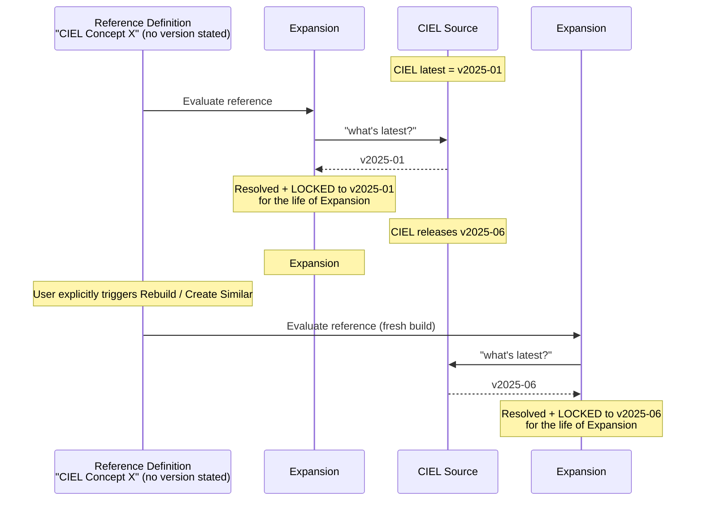
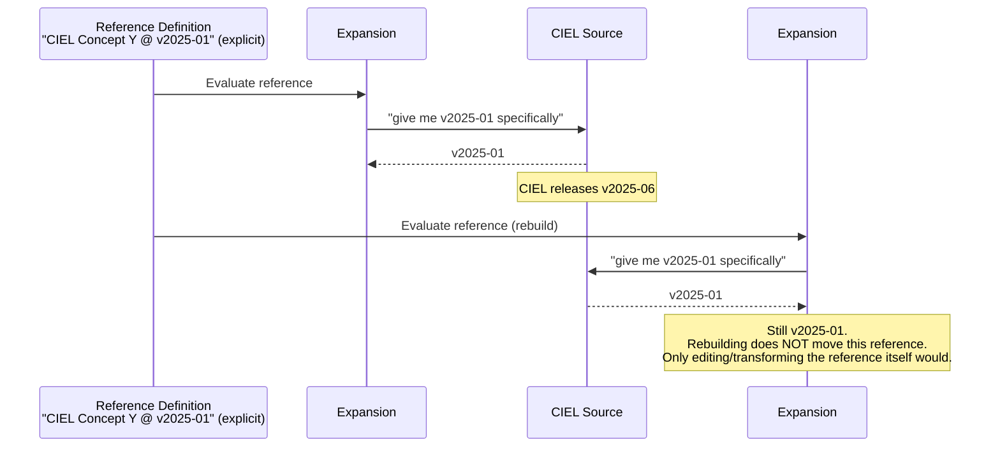
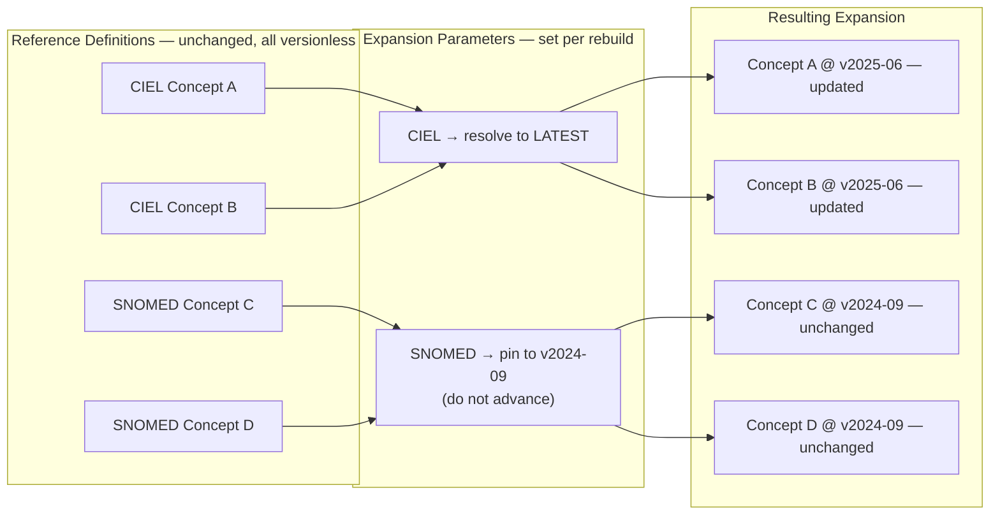

# Deep Dive: Collection Maintenance Workflow — Scoping for M44

**Purpose:** Discussion space to walk through the end-to-end "Update Collection to Latest Source Version" workflow, identify which requirements (reqs) already exist, and determine the minimum viable product (MVP) for Milestone 44.

**Context:** Issue [#2349](https://github.com/OpenConceptLab/ocl_issues/issues/2349) covers this workflow. Sunny flagged in the 2026-06-29 standup that the current in-scope tickets don't yet constitute a complete workflow — there are missing reqs and open design questions.

**Full spec:** [update-collection-source-version.md](update-collection-source-version.md)

---

## Decisions — 2026-06-30 Deep Dive

These were settled (or explicitly narrowed) in today's session. Where earlier draft language elsewhere in this doc conflicts, these decisions win — connecting notes have been added at each affected spot.

1. **Scope boundary:** This workflow assumes collections built on **versionless references with auto-expansion**. Updating **explicit-version references** is out of scope for this workflow — that's a separate problem, already handled by the Transform References workflow (#2339 / #2433 / #2282). See the Assumptions in [Background](#background-adding-content-from-a-version) below and [Example 2](#example-2--explicit-version-reference-pinned-regardless-of-rebuilds).
2. **Mental model (Jonathan):** "Locking" should not be framed as a separate mechanism from expansion parameters — it **is** an expansion parameter, applied to a single expansion. The sticky behavior in [Example 1](#example-1--versionless-reference-sticky-lock-within-an-expansion) is, conceptually, an expansion parameter being set the first time a versionless reference is evaluated. Open question: should this become an **explicit DB attribute** (persisted the moment it's first evaluated) rather than a value computed fresh on each evaluation? This affects how cheap Flavor C (the unpersisted preview, below) can actually be.
3. **Workflow has 3 phases (Sunny):**

   1. **Identification** — surfacing which content is outdated (diagram Steps 1–2: staleness banner, source version comparison)
   2. **How / What to update** — deciding which source(s), and via what mechanism, to bring up to date (diagram Steps 3–4: preview, decide)
   3. **Review / Confirm** — reviewing the result and committing (diagram Steps 5–7: rebuild, post-rebuild diff, publish)
4. **Build order — all-or-nothing first:** The backend will be built **all-or-nothing per source** first (accept the whole CIEL update, or don't). Selective accept/reject per concept is acknowledged as the **likely real-world primary path** users will actually want, but it is explicitly **deferred to a later UI layer**, not part of the initial build. This is a sequencing decision, not a permanent cut — see the connecting note in [Tying it back to the M44 workflow](#tying-it-back-to-the-m44-workflow).
5. **"Unpersisted/preview expansion" is the key missing capability.** This is what Flavor C is reaching for: a way to **evaluate** (not persist) just the affected references and show a diff/preview, instead of generating a full, expensive expansion every time. This is now the primary technical unknown blocking M44 scoping — see [Two Flavors of &#34;Diff&#34;](#two-flavors-of-diff--critical-design-question).
6. **Evaluation logic should be generalized, not feature-specific (Jonathan):** The reference-query/filter logic needed for preview/diff should be built as a **reusable capability across OCL**, not buried inside this one collection-maintenance feature. Evaluation should be **architected separately from persistence**, so the unpersisted evaluation path and the persisted expansion path can each be optimized independently. This is an architectural constraint on how Flavor C gets built, not just a UI decision.

---

## Background: Adding content from a version

There are three ways content can resolve to a specific source version inside a collection:

1. **Versionless reference** (no version specified) — resolves to the expansion's locked/evaluated source version.
2. **Versioned reference** (e.g., "Concept X from January CIEL") — resolves to the reference's own explicit version, which may differ from the expansion's locked version.
   - If a collection contains *only* versioned references, it will always compute against those pinned versions — never the expansion's locked version.
   - Transforming a versioned reference to point at a later CIEL version is currently supported, but that's a separate workflow from the one described here (see Decision 1 — scope boundary).
3. **Expansion-parameter override** — a versionless reference resolved against a specific source version set at the expansion level, not the reference level. See mechanism C in [Reference Definitions vs. Expansion Parameters](#reference-definitions-vs-expansion-parameters--visual-examples) below.

**Edge case:** a collection has multiple sources, each at a different version. Going through the CIEL update workflow (January → May) shouldn't force an update to LOINC's locked version too — LOINC can stay where it is and be updated later, independently, without bundling it into the CIEL update.

**Three phases (Decision 3 above):**

1. **Identification** — see what content is updated
2. **How / What** — decide what to update
3. **Review / Confirm** — update to that source version

**Open design questions:**

- **Hidden complexity:** how do we help the user pick the right expansion parameter without exposing expansion-parameter configuration to them directly? The workflow has to translate "accept the CIEL update" into the correct parameter change behind the scenes — see [Tying it back to the M44 workflow](#tying-it-back-to-the-m44-workflow). Should we also surface whether the user's collection contains any versioned references, since those won't be touched by this workflow?
- **Full complexity:** what does the complete version of this workflow look like — e.g., per-concept selection, the full linked-source test workflow? Not scoped for M44 — see Decision 4 (all-or-nothing first) and the spec's "Out of Scope for M44" list.

**Assumptions:**

* Versioned references are left alone and are handled in the Transform References workflow
* This workflow only applies to versionless references.
* Expansion parameters are the primary mechanism that are being leveraged here.

> See [Reference Definitions vs. Expansion Parameters — Visual Examples](#reference-definitions-vs-expansion-parameters--visual-examples) below for worked diagrams of these three mechanisms (versionless references, versioned references, expansion parameters) — it formalizes the assumptions above with sequence diagrams.

---

## End-to-End Workflow Diagram

---

> 📍 **TODO:** Once the Decisions above and the Reqs Inventory below are settled, summarize the agreed "Simple MVP" here. See [Minimum Viable Showcase Story](#minimum-viable-showcase-story-candidate---proposed-by-claude) near the end of this doc for a draft starting point.

---

## Potential Reqs Inventory

| #  | Requirement / Capability                                                              | Status                     | Ticket(s) | MVP?       |
| -- | -------------------------------------------------------------------------------------- | -------------------------- | --------- | ---------- |
| 1  | Staleness banner on collection header                                                  | ✅ Done                    | #2348     | ✅ Yes     |
| 2  | "Review Updates →" CTA that enters the update flow                                    | ✅ Done                    | #2348     | ✅ Yes     |
| 3  | **Source version comparison view** (side-by-side: current CIEL vs. new CIEL)     | ⬡ Not built               | #2349     | 🔴 Discuss |
| 4  | **Summary stats**: concepts added / retired / modified between two CIEL versions | ⬡ Not built               | #2349     | 🔴 Discuss |
| 5  | **Browsable diff list**: rows of added / retired / modified concepts             | ? Built but not optimized? | #2349     | 🔴 Discuss |
| 6  | "Create Similar" expansion pinned to new source version                                | ⬡ Not built               | #2349     | 🔴 Discuss |
| 7  | In-progress indicator while expansion is building                                      | ⬡ In Progress             | #2501     | ✅ Yes     |
| 8  | Expansion selector on Concepts/Mappings tabs                                           | ⬡ In Progress             | #2493     | ✅ Yes     |
| 9  | **"Accept Update" action** → triggers auto-expansion rebuild                    | ⬡ Not built               | #2349     | ✅ Yes     |
| 10 | **Post-rebuild diff** (pre vs. post expansion comparison)                        | ⬡ Not built               | #2349     | 🔴 Discuss |
| 11 | **Confirm / Reject rebuild** UI + revert logic                                   | ⬡ Not built               | #2349     | ✅ Yes     |
| 12 | Create new collection version                                                          | ✅ Existing                | —        | ✅ Yes     |

Legend: ✅ Done or confirmed in scope | ⬡ Not yet built | 🔴 Needs scoping discussion

---

## Two Flavors of "Diff" — Critical Design Question

This came up in the 2026-06-29 standup and is the key architectural issue to resolve.

### Flavor A — Source diff, filtered to your collection (lightweight)

- Compare the two CIEL versions directly (pre-computed or on-demand via the source diff API)
- Filter results to concepts/mappings that intersect with your collection's current expansion
- **No new expansion is computed** — uses the existing expansion + the CIEL diff
- Shows: "Of the N concepts that changed in CIEL, X of them are in your collection"
- **Limitation:** This is an approximation — it doesn't account for reference evaluation logic, cascades, or concepts that might enter/leave via expansion rules
- **Decision:** Do not pursue this. This is only a UI fix - it doesn't do anything in the API, which limits CLI or other non-UI work.

### Flavor C — Unpersisted Expansion (not authoritative, performant, FHIR-supported)

> **2026-06-30 decision:** this is now considered **the key missing capability** for the whole workflow (Decision 5). Per Jonathan (Decision 6), the underlying evaluation/reference-query logic should be built as a **generalized, reusable OCL capability** — not specific to this CL-update feature — and **architected separately from persistence**, so the unpersisted evaluation path and the persisted expansion path can each be optimized independently.

- **Concept:** "Auto-expand, but scoped to only the in-scope source version(s)" — smarter reference-query logic to constrain what gets evaluated, rather than re-evaluating or copying the entire expansion.
- This evaluation is separate from "locking," which applies during `$ResolveReference` (see Decision 2 above on how locking and expansion parameters relate).
- Query just the specific set of references that would be affected and preview them — informing the user what content would change, without persisting a new expansion.

### Flavor B — Expansion-to-expansion diff (authoritative but expensive)

- Create a new "test" expansion pinned to the new CIEL version
- Diff the test expansion against the current expansion
- Shows exactly what the user's collection would look like after upgrading
- **Limitation:** Expansions are expensive. Cannot be computed on the fly. Requires intentional "Create Similar" action and async wait.

**Superseded — Sunny's original proposal (2026-06-29 standup):** ~~Start with Flavor A as the comparison view (Req#3–5), using the CL diff filtered to the user's content, without requiring a new expansion.~~ **Decided against in the 2026-06-30 deep dive** — Flavor A is UI-only filtering on top of the existing diff; it doesn't change anything in the API, so it provides nothing to CLI or other non-UI consumers. Flavor C was proposed in its place.

**Current direction (2026-06-30):** Flavor C — an unpersisted, source-scoped expansion — is the new lightweight candidate. It works by evaluating reference queries against a specific source version without writing a full expansion object, which is the same lever as **expansion parameters** (mechanism C in [Reference Definitions vs. Expansion Parameters](#reference-definitions-vs-expansion-parameters--visual-examples) below) — "evaluate as if this source were pinned to vX," just without persisting the result. Flavor C is not yet fully designed (see open bullets above) — needs follow-up before it can be scoped into M44.

**Jonathan's constraint:** Expansions must be treated as expensive. We cannot compute hypothetical *persisted* expansions on the fly. Flavor C is being explored specifically because an unpersisted evaluation may sidestep that cost — but this needs validation before we rely on it.

### Discussion question (updated 2026-06-30)

> Flavor A is ruled out. Is Flavor C (unpersisted, source-scoped expansion) viable and sufficient for MVP, or do we fall back to Flavor B (full persisted "Create Similar" expansion diff) while Flavor C gets designed out?

### Open Questions — Flavor C feasibility (2026-06-30)

These are unresolved and need follow-up before Flavor C can be scoped:

- **Full copy vs. changed-subset only?** Should an unpersisted expansion copy the **full** evaluated content (unaffected rows untouched + reevaluated changed rows), or return **only the changed subset** and let the client reconcile it against the existing expansion? This is cost-dependent — we should avoid getting locked into the expensive full-copy approach for large collections. MSF-scale collections run ~16–17k references / ~5–8k concepts; a full-copy approach at that scale may not be meaningfully cheaper than just building a real expansion.
- **No defined performance threshold yet.** There's no agreed definition of "fast enough" for an unpersisted preview. Per Sunny: *"we'll probably have to come up with the definition of 'long time' at some point."* Until that's defined, we can't tell whether Flavor C is actually solving the cost problem or just moving it.
- **Cascading evaluation gotcha (Jonathan):** if a reference points to another value set/collection (a nested reference), an expansion-parameter change may need to **cascade into that child** reference's own evaluation. This isn't addressed by anything designed so far — Examples 1–3 above all assume a flat reference-to-concept relationship, not a reference-to-collection chain.

---

## Reference Definitions vs. Expansion Parameters — Visual Examples

This is the piece that caused confusion in the 2026-06-30 deep dive (Andy's questions about "why would it go to versionless?"). There are **three separate mechanisms** that interact, and it's easy to conflate them. These examples walk through each in isolation, then show how they combine.

### The three mechanisms

| Mechanism                                 | Where it lives                           | What it controls                                                                                              | Does it change on rebuild?                                                                           |
| ----------------------------------------- | ---------------------------------------- | ------------------------------------------------------------------------------------------------------------- | ---------------------------------------------------------------------------------------------------- |
| **A — Versionless reference**      | Stored per-reference, on the collection  | "Give me Concept X from Source S" — no version stated                                                        | Yes — re-evaluates to that source's latest at the moment of each fresh expansion build              |
| **B — Explicit-version reference** | Stored per-reference, on the collection  | "Give me Concept X from Source S, version V" — version is pinned in the reference itself                     | No — never changes automatically. Only changes if a person edits/transforms that specific reference |
| **C — Expansion parameter**        | Stored per-expansion (not per-reference) | Overrides how*all* versionless references to a given **source** resolve, for that one expansion build | Yes — can be changed independently on each rebuild, without touching any reference definitions      |

The key insight from the transcript: **A and B are properties of individual references. C operates at the whole-source level and is invisible to the user unless they go into expansion settings.** This is why Sunny flagged that "accept the CIEL update but not the SNOMED update" can't be done by editing references — both sources' references might be versionless (mechanism A), so the only lever is mechanism C.

> **Update from 2026-06-30 deep dive (Decision 2 — Jonathan):** "Locking" (the sticky behavior shown in Example 1) shouldn't be thought of as a fourth, separate mechanism — it **is** mechanism C, applied automatically to a single reference the first time it's evaluated. Whether that lock should become an **explicit DB attribute** (persisted at evaluation time) rather than a value computed fresh on each read is still open. This matters for Flavor C below: if locking has to persist *something*, an "unpersisted" preview still isn't entirely free.

---

### Example 1 — Versionless reference: "sticky" lock within an expansion

A versionless reference resolves to whatever is latest **at the moment an expansion is built**, then that resolved version stays fixed for that expansion — it does not silently drift forward when the source releases something newer.

**Takeaway:** the reference definition itself never says "v2025-01" or "v2025-06" — it just says "latest, evaluated once per expansion build." The version only changes when you build a *new* expansion.

---

### Example 2 — Explicit-version reference: pinned regardless of rebuilds

**Takeaway:** this is the escape hatch a user reaches for when they deliberately don't want a specific concept to follow future source updates (Andy's "form isn't ready to handle the retired concept" scenario).

---

### Example 3 — Expansion parameters: per-source override, not per-reference

This is the scenario from the standup: a collection references **both CIEL and SNOMED**, both have versionless references, both sources just released new versions, and the user wants to accept CIEL's update but **not** SNOMED's.

**Takeaway:** none of the four reference definitions changed. The split outcome is achieved entirely through the expansion parameters — a setting most users have never touched directly. This is the gap Sunny flagged: **today this flexibility exists in the API, but the M44 workflow doesn't yet expose a guided UI for it.**

---

### Tying it back to the M44 workflow

Joe's MSF + CIEL example from the standup maps directly onto Example 3:

- Both MSF's and CIEL's references in the collection are versionless.
- CIEL releases a new version → its own staleness banner.
- MSF has not released anything new → no banner for MSF.
- "Accept Update" on the CIEL banner should, under the hood, set an expansion parameter that advances *only* CIEL to latest, leaving MSF's resolved version exactly where it was.
- The user never sees or edits "expansion parameters" — the workflow has to translate "I accept the CIEL update" into the correct parameter change for them.

This confirms the **per-source banner design** (one banner per outdated source, not one banner for the whole collection) is the right mental model, and it clarifies what "Accept Update" actually has to do behind the scenes: it's an expansion-parameter change scoped to one source, not a reference edit.

It also confirms the limit Andy was probing: **there is no per-concept selection inside this mechanism.** If a user wants some CIEL concepts to update and others to stay behind, the only paths are (a) pre-emptively convert the ones they want frozen into explicit-version references (Example 2) before accepting the update, or (b) accept the whole-source update and then manually remove unwanted new content afterward via the References tab. This matches the spec's existing design note that "accept all and rebuild" is the happy path, with granular editing as a separate power-user activity.

**2026-06-30 decision (Decision 4):** the team agrees selective per-concept accept/reject is probably what most users actually want long-term — but the backend will be built **all-or-nothing per source first**, with selective UI layered on afterward. This is a build-order decision, not a permanent cut: it applies independently of the existing governance blocker on `tbv3-deferred-features.md`'s "Facilitated Per-Concept Accept/Reject" — even once governance input lands, the all-or-nothing backend ships first regardless.

**Connection to Flavor C (see Two Flavors of Diff above):** Example 3's "set an expansion parameter per source" is exactly the mechanism Flavor C is trying to exploit, minus persistence — instead of creating a real Expansion #2 record, Flavor C would evaluate "what would this collection look like if CIEL's expansion parameter were bumped to latest" on the fly, without writing it. If that turns out to be cheap enough, it could replace the "Create Similar" step in Step 3 of the main workflow entirely. Worth designing these two pieces together rather than in isolation.

---

## MVP Scoping Questions

These are the open questions to answer in the deep dive:

| #  | Question                                                                                                                                                | Options                                                                                                                                                                    |
| -- | ------------------------------------------------------------------------------------------------------------------------------------------------------- | -------------------------------------------------------------------------------------------------------------------------------------------------------------------------- |
| Q1 | Is the**source version comparison view** (Req#3–5, Step 2) required for MVP, or can the user go straight from banner → rebuild?                 | A) Required — user needs to see what changed before deciding  B) Optional — defer, show only a count in the banner                                                       |
| Q2 | Is the**"Create Similar" expansion preview** (Req#6, Step 3) required for MVP, or can users decide based on an unpersisted preview alone?               | A) Required — need full-fidelity preview before committing  B) Defer — too expensive for MVP; an unpersisted preview (Flavor C, if feasible — see Decision 5) is enough |
| Q3 | Is the**post-rebuild diff** (Req#10, Step 5) required for MVP, or is a simple "Rebuild succeeded / N changes" message enough?                     | A) Full browsable diff required  B) Summary stats only (N added, N retired) is enough  C) Defer — just show rebuild succeeded                                             |
| Q4 | How do we handle the**retired concepts** open question? When CIEL retires a concept in the user's collection, what is the right default behavior? | A) Leave the concept in the collection (tagged Retired) — governance default  B) Warn and suggest removing or pinning — implementer safety                               |
| Q5 | Is**multi-source handling** (multiple pending updates: CIEL + LOINC) in scope for MVP, or do we ship a single-source flow first?                  | A) Multi-source required from day 1  B) Ship single-source MVP, address multiple in follow-on                                                                              |

---

## Edge Cases to Address

| Edge Case                                                                                                                                 | Current Plan                                                                                                                                        | Resolved?                                              |
| ----------------------------------------------------------------------------------------------------------------------------------------- | --------------------------------------------------------------------------------------------------------------------------------------------------- | ------------------------------------------------------ |
| CIEL has released multiple new versions since the user's last update (e.g., user is on v1, latest is v4)                                  | Support version skipping: user can jump directly to v4 without stepping through v2, v3                                                              | ✅ In spec                                             |
| Expansion rebuild fails                                                                                                                   | Show error + Retry button; does**not** roll back reference changes                                                                            | ✅ In spec                                             |
| No relevant content changes (new CIEL version has no overlap with user's collection)                                                      | Show informational notice; user may still update their locked source version                                                                        | ✅ In spec                                             |
| User adds a concept from a new CIEL version while still locked to the old version                                                         | Warn that the concept can't appear in the current expansion; lock will shift on rebuild                                                             | ⬡ Needs implementation check (Joe flagged in standup) |
| Multiple sources have pending updates simultaneously                                                                                      | Handle as separate flows; user can batch into one new collection version at the end                                                                 | ✅ In spec, not yet built                              |
| User wants to exclude specific new concepts before rebuilding                                                                             | Exit to References tab, make changes, then trigger rebuild — not a guided per-concept workflow                                                     | ✅ Defined as out-of-scope for guided flow             |
| Reference points to another value set/collection (nested reference) — does an expansion-parameter change need to cascade into the child? | **Not yet addressed** (Jonathan, 2026-06-30) — see [Open Questions — Flavor C feasibility](#open-questions--flavor-c-feasibility-2026-06-30) | ❌ Not resolved                                        |
| Retired concept governance (OpenMRS impact)                                                                                               | **Open question** — input needed from Andy Kanter (governance) + Burke (OpenMRS)                                                             | ❌ Not resolved                                        |

---

## What's Already Shipped (M44 Context)

- **#2348 ✅** Staleness banner on collection header with "Review Updates" CTA
- **#2274 ✅** Checkbox-based actions for references
- **#2339 ✅** Reference transformation actions in References tab
- **#2433 ✅** CTA / Reference / Transform
- **#2282 ✅** Clean up collection references with cascade options
- **#2576 ✅** TBv3 Sources: Versions tab

**Currently in progress:**

- **#2493** Expansion selector on Concept/Mapping list in Collections (Sunny — PR raised)
- **#2501** Expansion in-progress indicator (open)

**Open / not yet started:**

- **#2349** Core update workflow (Sunny — assigned)
- **#2346** Real-time schema validation warnings for references (Sunny — open)
- **#2496** Reference details: show resolution context
- **#2280** Automated migration script for resource version reference transformation (Jon + Joe)
- **#2504** Analyze blast radius of resource version references (Jon + Joe + Joe)
- **#2535** Webhook for external sync and workflow automation (Jon)

---

## Minimum Viable Showcase Story (Candidate - Proposed by Claude)

The M44 milestone showcase story (from the milestone description) currently is:

> 1. Receives notification that CIEL v2026-04 is released
> 2. Reviews changes via dependency notification system
> 3. Uses linked source to test new version without committing
> 4. Previews impact on their collection (before/after comparison)
> 5. Decides to update via collection dependency update workflow
> 6. Applies update and creates new collection version
> 7. Downstream users are notified of collection update

**Proposed reduced MVP story for discussion:**

> 1. User visits their collection and sees a staleness banner (✅ done)
> 2. User clicks "Review Updates" and sees a summary of what changed in CIEL (Req#3–4)
> 3. User clicks "Accept Update" and rebuilds their auto-expansion (Req #9)
> 4. User sees post-rebuild summary (N added, N retired) and confirms (Reqs #10–11)
> 5. User creates a new collection version (✅ existing)

**What this cuts:**

- Browsable diff list with per-concept rows (Req #5) — defer; show counts only
- "Create Similar" test expansion preview (Req #6) — defer; too expensive for MVP
- Expansion selector comparison (Req #8) — still ships as its own feature (#2493), but decoupled from this workflow decision

This gives a working end-to-end flow with significantly less new development. The user can still make an informed decision based on counts and the banner, and confirm after seeing the rebuild summary.

> **Is this reduced story acceptable for the M44 showcase?**

