# Deep Dive: Collection Maintenance Workflow — Scoping for M44

**Purpose:** Discussion space to walk through the end-to-end "Update Collection to Latest Source Version" workflow, identify which requirements (reqs) already exist, and determine the minimum viable product (MVP) for Milestone 44.

**Context:** Issue [#2349](https://github.com/OpenConceptLab/ocl_issues/issues/2349) covers this workflow. Sunny flagged in the 2026-06-29 standup that the current in-scope tickets don't yet constitute a complete workflow — there are missing reqs and open design questions.

**Full spec:** [update-collection-source-version.md](update-collection-source-version.md)

---

## End-to-End Workflow Diagram

```mermaid
flowchart TD
    A([CIEL releases a new version]) --> B[User visits their collection]

    B --> C{Is a newer source\nversion available?}
    C -->|No| D[Normal collection view\nno action needed]
    C -->|Yes| E["⚠️ Staleness Banner shown\n'CIEL v2025-01-15 released. N references may be affected.'\n#2348 ✅ DONE"]

    E --> F{"User action?"}
    F -->|Ignores / dismisses| G[Banner persists\nno changes made]
    F -->|Clicks 'Review Updates →'| H

    subgraph STEP2 ["STEP 2 — What Changed in CIEL?"]
        H["Source Version Comparison View\nLeft: current locked CIEL version\nRight: new CIEL version\n⬡ NOT YET BUILT"]
        H --> I["Summary stats:\n+N concepts added  |  -N retired  |  ~N modified\n⬡ NOT YET BUILT"]
        I --> J["Browsable diff list\n(Added / Retired / Modified rows)\n⬡ NOT YET BUILT"]
    end

    J --> K{"Want to preview impact\non YOUR collection first?"}

    K -->|"Yes — test before committing"| L
    K -->|"No — ready to decide"| N

    subgraph STEP3 ["STEP 3 — Test Without Committing"]
        L["'Create Similar' expansion\npinned to new CIEL version\nruns alongside current expansion\n⬡ NOT YET BUILT (depends on #2493, #2501)"]
        L --> M["⏳ Expansion builds asynchronously\n#2501 In-progress indicator ⬡ In Progress"]
        M --> M2["Expansion Selector on Concepts/Mappings tabs:\nSwitch between current and test expansion\n#2493 ⬡ In Progress"]
        M2 --> M3["User browses their collection content\nunder the new CIEL version"]
    end

    M3 --> N

    subgraph STEP4 ["STEP 4 — Decide"]
        N{"Accept the update?"}
        N -->|"Keep current version"| O["Dismiss workflow\nBanner and notification persist\nNo changes made"]
        N -->|"Accept Update"| P
    end

    subgraph STEP5 ["STEP 5 — Rebuild"]
        P["Confirmation dialog:\n'Rebuild auto-expansion to CIEL new version?\nCurrent expansion preserved for comparison.'"]
        P --> Q["System rebuilds auto-expansion\nagainst new CIEL version\n(runs alongside current — does not overwrite)\n⬡ NOT YET BUILT"]
        Q --> R["⏳ Rebuild processes asynchronously"]
        R --> S["Post-rebuild diff shown:\nN added, N retired, N modified\nSystem recommendation where possible\n⬡ NOT YET BUILT"]
    end

    subgraph STEP6 ["STEP 6 — Confirm or Reject"]
        S --> T{"Confirm rebuild?"}
        T -->|"Confirm"| U["New auto-expansion becomes active\nOld expansion retained temporarily"]
        T -->|"Reject"| V["Rebuild discarded\nReverts to previous auto-expansion\nLocked source version reverts"]
        V --> O
    end

    subgraph STEP7 ["STEP 7 — Publish"]
        U --> W["'New Version' action\nUnversioned refs → new CIEL version in expansion params\nNew auto-expansion computed\n✅ EXISTING FLOW"]
        W --> X(["New collection version published\nNotification dismissed"])
    end
```

---

## Potential Reqs Inventory

| #  | Requirement / Capability                                                              | Status                     | Ticket(s) | MVP?       |
| -- | -------------------------------------------------------------------------------------- | -------------------------- | --------- | ---------- |
| 1  | Staleness banner on collection header                                                  | ✅ Done                    | #2348     | ✅ Yes     |
| 2  | "Review Updates →" CTA that enters the update flow                                    | ✅ Done                    | #2348     | ✅ Yes     |
| 3  | **Source version comparison view** (side-by-side: current CIEL vs. new CIEL)     | ⬡ Not built               | #2349     | 🔴 Discuss |
| 4  | **Summary stats**: concepts added / retired / modified between two CIEL versions | ⬡ Not built               | #2349     | 🔴 Discuss |
| 5  | **Browsable diff list**: rows of added / retired / modified concepts             | ? Built but not optimized? | #2349     | 🔴 Discuss |
| 6  | "Create Similar" expansion pinned to new source version                                | ⬡ Not built               | #2349     | 🔴 Discuss |
| 7  | In-progress indicator while expansion is building                                      | ⬡ In Progress             | #2501     | ✅ Yes     |
| 8  | Expansion selector on Concepts/Mappings tabs                                           | ⬡ In Progress             | #2493     | ✅ Yes     |
| 9  | **"Accept Update" action** → triggers auto-expansion rebuild                    | ⬡ Not built               | #2349     | ✅ Yes     |
| 10 | **Post-rebuild diff** (pre vs. post expansion comparison)                        | ⬡ Not built               | #2349     | 🔴 Discuss |
| 11 | **Confirm / Reject rebuild** UI + revert logic                                   | ⬡ Not built               | #2349     | ✅ Yes     |
| 12 | Create new collection version                                                          | ✅ Existing                | —        | ✅ Yes     |

Legend: ✅ Done or confirmed in scope | ⬡ Not yet built | 🔴 Needs scoping discussion

---

## Two Flavors of "Diff" — Critical Design Question

This came up in the 2026-06-29 standup and is the key architectural issue to resolve.

### Flavor A — Source diff, filtered to your collection (lightweight)

- Compare the two CIEL versions directly (pre-computed or on-demand via the source diff API)
- Filter results to concepts/mappings that intersect with your collection's current expansion
- **No new expansion is computed** — uses the existing expansion + the CIEL diff
- Shows: "Of the N concepts that changed in CIEL, X of them are in your collection"
- **Limitation:** This is an approximation — it doesn't account for reference evaluation logic, cascades, or concepts that might enter/leave via expansion rules

### Flavor B — Expansion-to-expansion diff (authoritative but expensive)

- Create a new "test" expansion pinned to the new CIEL version
- Diff the test expansion against the current expansion
- Shows exactly what the user's collection would look like after upgrading
- **Limitation:** Expansions are expensive. Cannot be computed on the fly. Requires intentional "Create Similar" action and async wait.

**Sunny's proposal (standup):** Start with Flavor A as the comparison view (Req#3–5), using the CL diff filtered to the user's content, without requiring a new expansion. Then Flavor B (Reqs #6, #8) is the optional deeper preview step the user can invoke if they want full fidelity.

**Jonathan's constraint:** Expansions must be treated as expensive. We cannot compute hypothetical expansions on the fly. Any preview that requires a new expansion must be an explicit user action.

### Discussion question

> Is Flavor A sufficient for the MVP, or do we need Flavor B before the user can make a confident decision?

---

## MVP Scoping Questions

These are the open questions to answer in the deep dive:

| #  | Question                                                                                                                                                | Options                                                                                                                                      |
| -- | ------------------------------------------------------------------------------------------------------------------------------------------------------- | -------------------------------------------------------------------------------------------------------------------------------------------- |
| Q1 | Is the**source version comparison view** (Req#3–5, Step 2) required for MVP, or can the user go straight from banner → rebuild?                 | A) Required — user needs to see what changed before deciding  B) Optional — defer, show only a count in the banner                         |
| Q2 | Is the**"Create Similar" expansion preview** (Req#6, Step 3) required for MVP, or can users decide based on the source diff alone?                      | A) Required — need full-fidelity preview before committing  B) Defer — too expensive for MVP; source diff (Flavor A) is enough             |
| Q3 | Is the**post-rebuild diff** (Req#10, Step 5) required for MVP, or is a simple "Rebuild succeeded / N changes" message enough?                     | A) Full browsable diff required  B) Summary stats only (N added, N retired) is enough  C) Defer — just show rebuild succeeded               |
| Q4 | How do we handle the**retired concepts** open question? When CIEL retires a concept in the user's collection, what is the right default behavior? | A) Leave the concept in the collection (tagged Retired) — governance default  B) Warn and suggest removing or pinning — implementer safety |
| Q5 | Is**multi-source handling** (multiple pending updates: CIEL + LOINC) in scope for MVP, or do we ship a single-source flow first?                  | A) Multi-source required from day 1  B) Ship single-source MVP, address multiple in follow-on                                                |

---

## Edge Cases to Address

| Edge Case                                                                                                | Current Plan                                                                                    | Resolved?                                              |
| -------------------------------------------------------------------------------------------------------- | ----------------------------------------------------------------------------------------------- | ------------------------------------------------------ |
| CIEL has released multiple new versions since the user's last update (e.g., user is on v1, latest is v4) | Support version skipping: user can jump directly to v4 without stepping through v2, v3          | ✅ In spec                                             |
| Expansion rebuild fails                                                                                  | Show error + Retry button; does **not** roll back reference changes                      | ✅ In spec                                             |
| No relevant content changes (new CIEL version has no overlap with user's collection)                     | Show informational notice; user may still update their locked source version                    | ✅ In spec                                             |
| User adds a concept from a new CIEL version while still locked to the old version                        | Warn that the concept can't appear in the current expansion; lock will shift on rebuild         | ⬡ Needs implementation check (Joe flagged in standup) |
| Multiple sources have pending updates simultaneously                                                     | Handle as separate flows; user can batch into one new collection version at the end             | ✅ In spec, not yet built                              |
| User wants to exclude specific new concepts before rebuilding                                            | Exit to References tab, make changes, then trigger rebuild — not a guided per-concept workflow | ✅ Defined as out-of-scope for guided flow             |
| Retired concept governance (OpenMRS impact)                                                              | **Open question** — input needed from Andy Kanter (governance) + Burke (OpenMRS)         | ❌ Not resolved                                        |

---

## What's Already Shipped (M44 Context)

- **#2348 ✅** Staleness banner on collection header with "Review Updates" CTA
- **#2274 ✅** Checkbox-based actions for references
- **#2339 ✅** Reference transformation actions in References tab
- **#2433 ✅** CTA / Reference / Transform
- **#2282 ✅** Clean up collection references with cascade options
- **#2576 ✅** TBv3 Sources: Versions tab

**Currently in progress:**

- **#2493** Expansion selector on Concept/Mapping list in Collections (Sunny — PR raised)
- **#2501** Expansion in-progress indicator (open)

**Open / not yet started:**

- **#2349** Core update workflow (Sunny — assigned)
- **#2346** Real-time schema validation warnings for references (Sunny — open)
- **#2496** Reference details: show resolution context
- **#2280** Automated migration script for resource version reference transformation (Jon + Joe)
- **#2504** Analyze blast radius of resource version references (Jon + Joe + Joe)
- **#2535** Webhook for external sync and workflow automation (Jon)

---

## Minimum Viable Showcase Story (Candidate - Proposed by Claude)

The M44 milestone showcase story (from the milestone description) currently is:

> 1. Receives notification that CIEL v2026-04 is released
> 2. Reviews changes via dependency notification system
> 3. Uses linked source to test new version without committing
> 4. Previews impact on their collection (before/after comparison)
> 5. Decides to update via collection dependency update workflow
> 6. Applies update and creates new collection version
> 7. Downstream users are notified of collection update

**Proposed reduced MVP story for discussion:**

> 1. User visits their collection and sees a staleness banner (✅ done)
> 2. User clicks "Review Updates" and sees a summary of what changed in CIEL (Req#3–4)
> 3. User clicks "Accept Update" and rebuilds their auto-expansion (Req #9)
> 4. User sees post-rebuild summary (N added, N retired) and confirms (Reqs #10–11)
> 5. User creates a new collection version (✅ existing)

**What this cuts:**

- Browsable diff list with per-concept rows (Req #5) — defer; show counts only
- "Create Similar" test expansion preview (Req #6) — defer; too expensive for MVP
- Expansion selector comparison (Req #8) — still ships as its own feature (#2493), but decoupled from this workflow decision

This gives a working end-to-end flow with significantly less new development. The user can still make an informed decision based on counts and the banner, and confirm after seeing the rebuild summary.

> **Is this reduced story acceptable for the M44 showcase?**

